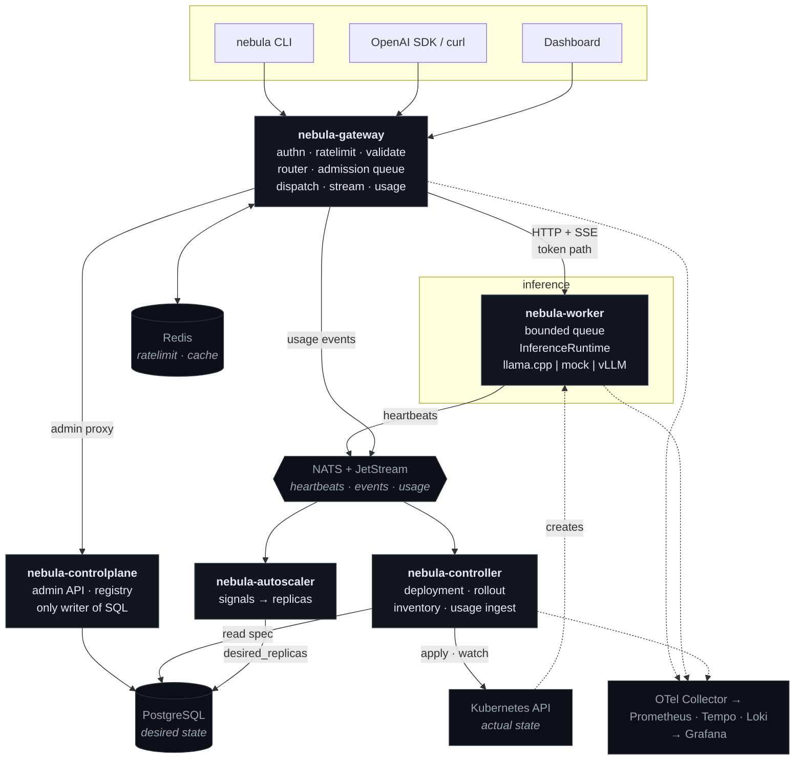

# NEBULA

**A self-hostable AI inference cloud.** Register a model, deploy it, and get a single
OpenAI-compatible endpoint with intelligent routing, bounded queuing, autoscaling, canary rollouts,
and end-to-end observability — running on Kubernetes, on a laptop.

```bash
nebula model register ./qwen2.5-0.5b-instruct-q4_k_m.gguf --name qwen2.5 --version 0.5b-q4
nebula deploy qwen2.5:0.5b-q4 --replicas 2 --route qwen2.5-chat --wait
```

```python
from openai import OpenAI
client = OpenAI(base_url="https://nebula.local/v1", api_key="nbk_...")
for chunk in client.chat.completions.create(
        model="qwen2.5-chat", messages=[{"role": "user", "content": "hello"}], stream=True):
    print(chunk.choices[0].delta.content or "", end="")
```

---

> ## Project status — Phase 0 (design)
>
> **This repository currently contains architecture and design documents only. No implementation code
> exists yet.** The commands above describe the system being built, not one you can run today.
>
> Implementation begins at [Phase 1](docs/roadmap.md#phase-1--repository-configuration-database-migrations)
> after design review. This section is updated at the end of every phase with what is actually
> working — see [Capability status](#capability-status).

---

## What NEBULA is, and is not

NEBULA is the control plane around model serving: identity, placement, admission, routing,
reliability, progressive delivery, and accounting.

It is **not** an inference engine — llama.cpp, vLLM, and TGI do the generation, behind a runtime
abstraction. It is **not** a Kubernetes replacement — it generates scheduling constraints and admits
against real capacity, then lets kube-scheduler place pods
([ADR-0005](docs/architecture-decisions/0005-cooperate-with-kubernetes.md)).

The design principle that governs the rest: **nothing is fabricated**. No synthetic metrics, no demo
data path in the dashboard, no cost figures without their assumptions, no "production" label on a
stub. Where something is designed but unverified — GPU scheduling on hardware that does not exist here
— it says so.

## Architecture



A text version of this diagram, with the request path annotated, is in
[docs/architecture.md §5](docs/architecture.md#5-architecture-diagram).

**The request path**, which is where most of the engineering is:

```
accept → identify → authenticate → authorize → validate → rate limit
       → resolve route → select endpoint → [admission queue] → dispatch
       → generate → stream → account
```

Every stage is named, bounded, instrumented, and has defined behaviour when it fails. See
[architecture.md §6](docs/architecture.md#6-the-request-path).

## Key design decisions

| Decision | Why |
|----------|-----|
| **Tokens travel over HTTP; NATS carries control and telemetry only** | A broker on the token path costs time-to-first-token and makes NATS a hard dependency of inference. Inference keeps working when NATS is down. [ADR-0003](docs/architecture-decisions/0003-push-dispatch-and-nats-scope.md) |
| **The router is a library, not a service** | A per-request hop to a router adds latency and a failure domain without adding capability, and loses the caller's own failure observations. [ADR-0004](docs/architecture-decisions/0004-router-as-library.md) |
| **NEBULA generates constraints; kube-scheduler places pods** | Kubernetes already solves placement. What it cannot do is know a GGUF needs 6 GiB — that translation is the value NEBULA adds. [ADR-0005](docs/architecture-decisions/0005-cooperate-with-kubernetes.md) |
| **Clients call a *route*, not a deployment** | This one indirection is what makes canary, A/B, blue-green, and rollback possible without clients changing anything. [ADR-0009](docs/architecture-decisions/README.md#adr-0009) |
| **Desired state in PostgreSQL, actual state in Kubernetes** | Naming one owner per fact is what keeps a control plane from acting on stale copies of itself. [ADR-0008](docs/architecture-decisions/README.md#adr-0008) |
| **Never retry after the first token** | A streamed response cannot be un-sent; retrying would concatenate two generations into text no model produced. [ADR-0013](docs/architecture-decisions/README.md#adr-0013) |
| **Model versions are immutable; rollback is a new revision** | "What exactly was serving at 14:32 last Tuesday" has to be answerable. [ADR-0010](docs/architecture-decisions/README.md#adr-0010) |

All twenty-four: [docs/architecture-decisions/](docs/architecture-decisions/).

## Documentation

| Document | Contents |
|----------|----------|
| [architecture.md](docs/architecture.md) | Design axioms, components, service boundaries, request path, control loops, event flows, failure-mode expectations, observability, cost model |
| [data-model.md](docs/data-model.md) | PostgreSQL schema, constraints, immutability triggers, partitioning, row-level security, migration policy |
| [api.md](docs/api.md) | OpenAI-compatible surface, control API, internal worker contract, `InferenceRuntime` interface, CLI contract |
| [deployment-architecture.md](docs/deployment-architecture.md) | Namespaces, RBAC, NetworkPolicy, probes, artifact storage, Helm layout, kind topology, GPU optionality, CI |
| [repository-structure.md](docs/repository-structure.md) | Monorepo layout, module strategy, dependency rules, conventions |
| [roadmap.md](docs/roadmap.md) | Phases 0–18 with deliverables, tests, and exit criteria |
| [risk-register.md](docs/risk-register.md) | Twenty scored risks with mitigations and residuals |
| [architecture-decisions/](docs/architecture-decisions/) | ADRs |

Written during implementation: `development.md`, `deployment.md`, `model-runtime.md`,
`observability.md`, `security.md`, `reliability.md`.

## Capability status

Updated at the end of every phase. Nothing is marked working until it is demonstrable from a clean
checkout.

| Capability | Status | Phase |
|------------|--------|-------|
| Architecture, data model, API contracts, ADRs | ✅ designed | 0 |
| Schema, migrations, config, telemetry primitives | ⬜ not started | 1 |
| Control plane, model registry, artifact store | ⬜ not started | 2 |
| Runtime abstraction, llama.cpp + mock runtimes | ⬜ not started | 3 |
| Gateway, OpenAI-compatible API, streaming | ⬜ not started | 4 |
| Deployment controller, Kubernetes integration, Helm | ⬜ not started | 5 |
| Health-aware routing, routing strategies | ⬜ not started | 6 |
| Bounded queues, concurrency control, backpressure | ⬜ not started | 7 |
| Metrics, logs, traces, Grafana dashboards | ⬜ not started | 8 |
| Autoscaling | ⬜ not started | 9 |
| Retries, breakers, timeouts, graceful shutdown | ⬜ not started | 10 |
| Model versioning, rollback | ⬜ not started | 11 |
| Canary rollouts, A/B testing | ⬜ not started | 12 |
| Token accounting, cost estimation, usage analytics | ⬜ not started | 13 |
| CLI | ⬜ not started | 14 |
| Dashboard | ⬜ not started | 15 |
| Load testing, failure testing | ⬜ not started | 16 |
| Security hardening | ⬜ not started | 17 |
| GPU scheduling and vLLM runtime | ⚠️ designed, **cannot be verified** — no GPU on the development hardware ([R-07](docs/risk-register.md#r-07--gpu-paths-cannot-be-verified-on-the-available-hardware--l-high--i-medium)) | — |

## Known limitations (by design, in v1)

No multi-cluster federation · no training or fine-tuning · no cross-org worker sharing · cost
*estimation* only, never billing · no distributed circuit breaking · no prompt or semantic caching ·
no synchronous inference over a message broker · no statistical-significance claims beyond what the
implemented analysis supports · no `kubectl get nebuladeployments` until the CRD stage
([ADR-0006](docs/architecture-decisions/0006-staged-orchestration.md)).

Reasoning for each: [architecture.md §12](docs/architecture.md#12-explicit-non-goals-for-v1).

## Technology

Go (control plane, gateway, CLI) · Python (inference worker) · PostgreSQL · Redis · NATS + JetStream ·
Kubernetes + Helm + kind · Prometheus, OpenTelemetry, Tempo, Loki, Grafana · React + TypeScript ·
k6 · GitHub Actions.

Every dependency has a justification in
[architecture.md §3.2](docs/architecture.md#32-infrastructure-dependencies-and-why-each-exists),
including the ones that were rejected.

## License

To be decided before the first public release.
