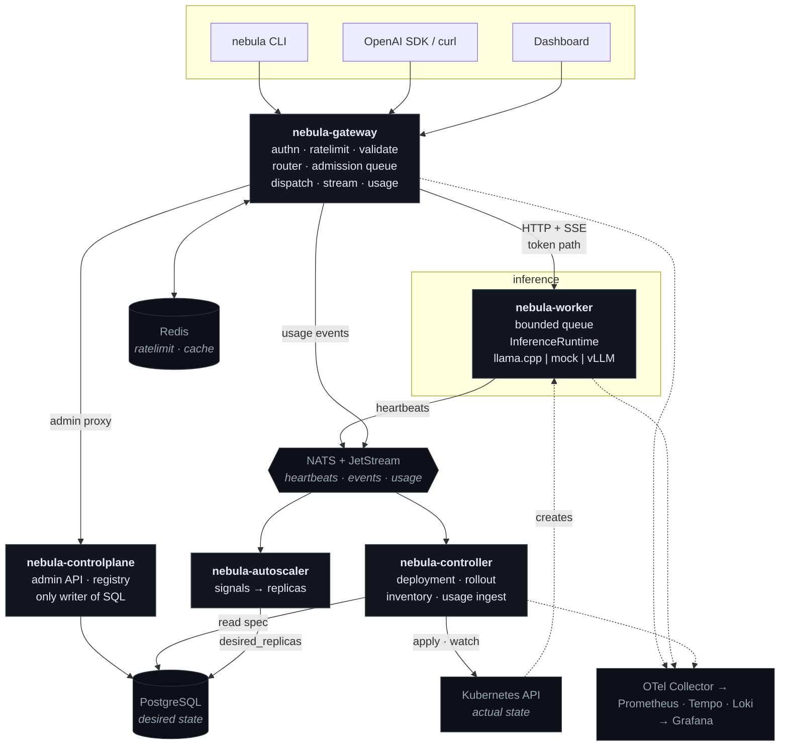

# NEBULA

**A self-hostable AI inference cloud.** Register a model, deploy it, and get a single
OpenAI-compatible endpoint with intelligent routing, bounded queuing, autoscaling, canary rollouts,
and end-to-end observability — running on Kubernetes, on a laptop.

```bash
nebula model register ./qwen2.5-0.5b-instruct-q4_k_m.gguf --name qwen2.5 --version 0.5b-q4
nebula deploy qwen2.5:0.5b-q4 --replicas 2 --route qwen2.5-chat --wait
```

```python
from openai import OpenAI
client = OpenAI(base_url="https://nebula.local/v1", api_key="nbk_...")
for chunk in client.chat.completions.create(
        model="qwen2.5-chat", messages=[{"role": "user", "content": "hello"}], stream=True):
    print(chunk.choices[0].delta.content or "", end="")
```

---

> ## Project status — Phase 3 complete
>
> **A real model now streams real tokens through a real worker. There is still no gateway and no
> Kubernetes.** The `nebula deploy` commands above describe the finished system, not what runs today.
>
> What works now: everything from Phase 2 — the PostgreSQL schema with its constraints, triggers and
> row-level security, the migration runner, layered configuration, structured logging with request-ID
> and trace correlation, API-key authentication with scopes, the model registry with immutable
> versions, deployment records with revision history, and the eight-state deployment lifecycle
> enforced by a database trigger
> ([ADR-0027](docs/architecture-decisions/0027-deployment-state-machine.md)) — plus the inference
> worker: the `InferenceRuntime` abstraction, a llama.cpp adapter that supervises upstream
> `llama-server` as a child process, a declared mock stub, a bounded priority queue with absolute
> deadlines, cancellation that actually stops compute, drain, probes and Prometheus metrics.
>
> The abstraction is verified rather than asserted: one conformance suite runs unchanged against both
> adapters, with no test skipped or overridden for either, and a separate suite streams tokens out of a
> real GGUF and asserts on their content. 145 tests, green.
>
> What this deliberately does NOT do: route. A worker answers for itself and nothing decides which
> worker to ask — that is Phase 6, and saying so here keeps a temporary shortcut from becoming the
> design. There is still no Kubernetes, so `POST /v1/deployments` answers `202 Accepted` with
> `status.reconciled` false. Artifact upload still has no presigned target, and `finalize` still
> compares the checksum the client declared against the one it presents rather than hashing the bytes —
> reported as `verification: declared_checksum`, not as verified. The worker container images are
> written but unbuilt: no Docker daemon was available where this phase was developed, so CI is what
> will prove them.
>
> Next: [Phase 4](docs/roadmap.md#phase-4--api-gateway-and-openai-compatible-api) — the gateway and the
> OpenAI-compatible API. See [Capability status](#capability-status).

## Running it today

```bash
make preflight        # check the toolchain
make db-up            # PostgreSQL 16 in Docker
make migrate-up       # apply the schema
make test             # Go unit tests
make test-integration # Go tests against the real database
make run-controlplane # seeds a dev org and prints an API key, once
```

And the inference worker, which is Python and has its own targets:

```bash
make worker-install   # the worker plus its development extra
make worker-lint      # ruff and mypy --strict
make worker-test      # 103 tests, no engine or model needed
make run-worker-mock  # the declared stub: real API, no real tokens
```

For the real thing you need a `llama-server` binary and a model. The fixture model is
*trained* rather than downloaded, in about seven seconds
([ADR-0028](docs/architecture-decisions/0028-locally-trained-test-fixture-model.md)):

```bash
export NEBULA_LLAMA_SERVER_BIN=/path/to/llama-server
make worker-model              # trains a 1.6 MB GGUF that llama-server loads unmodified
make worker-test-integration   # 145 tests, streaming real tokens from a real engine
```

[workers/inference/README.md](workers/inference/README.md) has the whole surface: the
protocol, the endpoints, every environment variable, and what is deliberately absent.

`run-controlplane` logs a line containing `api_key` on its first start. That key is
shown once and cannot be recovered — the server stores an HMAC — so copy it, then:

```bash
KEY=nbk_...                                   # from the startup log
BASE=http://localhost:8082
curl -H "Authorization: Bearer $KEY" $BASE/v1/me
curl $BASE/openapi.yaml                       # the contract, no credential needed

# register a model and a version, then make it ready
MODEL=$(curl -sX POST -H "Authorization: Bearer $KEY" -H 'Content-Type: application/json' \
  -d '{"name":"qwen2.5","task":"chat"}' $BASE/v1/models | jq -r .id)
SUM=$(printf 'ab%.0s' {1..32})                # a placeholder digest; see the note below
VERSION=$(curl -sX POST -H "Authorization: Bearer $KEY" -H 'Content-Type: application/json' \
  -d "{\"version\":\"0.5b-q4\",\"format\":\"mock\",\"runtime\":\"mock\",
       \"artifact_uri\":\"s3://nebula/$SUM\",\"size_bytes\":394000000,
       \"checksum_sha256\":\"$SUM\",\"context_window\":32768}" \
  $BASE/v1/models/$MODEL/versions | jq -r .id)
curl -sX POST -H "Authorization: Bearer $KEY" -H 'Content-Type: application/json' \
  -d "{\"checksum_sha256\":\"$SUM\"}" $BASE/v1/model-versions/$VERSION/finalize | jq .verification
# → "declared_checksum": the two declarations agreed; the bytes were not read.

# create a deployment (202, not 201) and walk its lifecycle
DEP=$(curl -sX POST -H "Authorization: Bearer $KEY" -H 'Content-Type: application/json' \
  -d "{\"name\":\"qwen-prod\",\"model_version_id\":\"$VERSION\",\"replicas\":2}" \
  $BASE/v1/deployments | jq -r .id)
curl -sX POST -H "Authorization: Bearer $KEY" -H 'Content-Type: application/json' \
  -d '{"from":"pending","to":"ready","reason":"ReplicasReady"}' \
  $BASE/v1/deployments/$DEP/transition | jq .error.message
# → "a deployment cannot move from pending to ready; from pending it may move to:
#    failed, provisioning, stopping"  — the state machine, refusing in the database

curl -s -H "Authorization: Bearer $KEY" $BASE/v1/deployments/$DEP/transitions | jq -r \
  '.data[] | "\(.from_state // "-") -> \(.to_state)  \(.reason)"'
curl -s -H "Authorization: Bearer $KEY" "$BASE/v1/audit-logs?limit=20" | jq -r '.data[].action'
```

The `mock` format and runtime are a declared development stub: the registry refuses
them unless `NEBULA_DEV_MOCK_RUNTIME=true`, and always in production. The checksum
above is a placeholder because nothing reads artifact bytes yet — `finalize` reports
`verification: declared_checksum` rather than claiming otherwise.

---

## What NEBULA is, and is not

NEBULA is the control plane around model serving: identity, placement, admission, routing,
reliability, progressive delivery, and accounting.

It is **not** an inference engine — llama.cpp, vLLM, and TGI do the generation, behind a runtime
abstraction. It is **not** a Kubernetes replacement — it generates scheduling constraints and admits
against real capacity, then lets kube-scheduler place pods
([ADR-0005](docs/architecture-decisions/0005-cooperate-with-kubernetes.md)).

The design principle that governs the rest: **nothing is fabricated**. No synthetic metrics, no demo
data path in the dashboard, no cost figures without their assumptions, no "production" label on a
stub. Where something is designed but unverified — GPU scheduling on hardware that does not exist here
— it says so.

## Architecture



A text version of this diagram, with the request path annotated, is in
[docs/architecture.md §5](docs/architecture.md#5-architecture-diagram).

**The request path**, which is where most of the engineering is:

```
accept → identify → authenticate → authorize → validate → rate limit
       → resolve route → select endpoint → [admission queue] → dispatch
       → generate → stream → account
```

Every stage is named, bounded, instrumented, and has defined behaviour when it fails. See
[architecture.md §6](docs/architecture.md#6-the-request-path).

## Key design decisions

| Decision | Why |
|----------|-----|
| **Tokens travel over HTTP; NATS carries control and telemetry only** | A broker on the token path costs time-to-first-token and makes NATS a hard dependency of inference. Inference keeps working when NATS is down. [ADR-0003](docs/architecture-decisions/0003-push-dispatch-and-nats-scope.md) |
| **The router is a library, not a service** | A per-request hop to a router adds latency and a failure domain without adding capability, and loses the caller's own failure observations. [ADR-0004](docs/architecture-decisions/0004-router-as-library.md) |
| **NEBULA generates constraints; kube-scheduler places pods** | Kubernetes already solves placement. What it cannot do is know a GGUF needs 6 GiB — that translation is the value NEBULA adds. [ADR-0005](docs/architecture-decisions/0005-cooperate-with-kubernetes.md) |
| **Clients call a *route*, not a deployment** | This one indirection is what makes canary, A/B, blue-green, and rollback possible without clients changing anything. [ADR-0009](docs/architecture-decisions/README.md#adr-0009) |
| **Desired state in PostgreSQL, actual state in Kubernetes** | Naming one owner per fact is what keeps a control plane from acting on stale copies of itself. [ADR-0008](docs/architecture-decisions/README.md#adr-0008) |
| **Never retry after the first token** | A streamed response cannot be un-sent; retrying would concatenate two generations into text no model produced. [ADR-0013](docs/architecture-decisions/README.md#adr-0013) |
| **Model versions are immutable; rollback is a new revision** | "What exactly was serving at 14:32 last Tuesday" has to be answerable. [ADR-0010](docs/architecture-decisions/README.md#adr-0010) |

All twenty-eight: [docs/architecture-decisions/](docs/architecture-decisions/).

## Documentation

| Document | Contents |
|----------|----------|
| [architecture.md](docs/architecture.md) | Design axioms, components, service boundaries, request path, control loops, event flows, failure-mode expectations, cost model, non-goals |
| [components.md](docs/components.md) | Every component as responsibility / inputs / outputs / dependencies / failure modes / scaling — and what must **not** be a separate microservice |
| [diagrams.md](docs/diagrams.md) | System, component, request, deployment, model-registration, failure/recovery, ER, Kubernetes, and dependency-graph diagrams |
| [data-model.md](docs/data-model.md) | PostgreSQL schema, constraints, immutability triggers, partitioning, row-level security, migration policy |
| [api.md](docs/api.md) | OpenAI-compatible surface, control API, internal worker contract, `InferenceRuntime` interface, CLI contract |
| [events.md](docs/events.md) | NATS subject catalogue, per-event schemas, delivery semantics, consumer contracts, schema evolution |
| [security-boundaries.md](docs/security-boundaries.md) | Trust zones, boundary contracts, identity and credentials, authorization, tenant isolation, threat table |
| [observability.md](docs/observability.md) | Telemetry pipeline, metric catalogue with cardinality budget, span model, log schema, correlation path, SLOs and alerts |
| [deployment-architecture.md](docs/deployment-architecture.md) | Namespaces, RBAC, NetworkPolicy, probes, artifact storage, Helm layout, kind topology, GPU optionality, CI |
| [repository-structure.md](docs/repository-structure.md) | Monorepo layout, module strategy, dependency rules, conventions |
| [workers/inference/README.md](workers/inference/README.md) | The inference worker: the `InferenceRuntime` contract, both adapters, the worker API, configuration, the fixture model |
| [roadmap.md](docs/roadmap.md) | Phases 0–18 with deliverables, tests, and exit criteria |
| [risk-register.md](docs/risk-register.md) | Twenty scored risks with mitigations and residuals |
| [architecture-decisions/](docs/architecture-decisions/) | ADR index (28); eight of them, including every one written during implementation, as full files |

Written during implementation: `development.md`, `deployment.md`, `model-runtime.md`,
`reliability.md`, and `security.md` (the operational threat model extending
[security-boundaries.md](docs/security-boundaries.md)).

### Design deliverable map

| # | Deliverable | Where |
|---|-------------|-------|
| 1 | System architecture diagram | [diagrams.md §1](docs/diagrams.md#1-system-architecture) · text version [architecture.md §5](docs/architecture.md#5-architecture-diagram) |
| 2 | Component diagram | [diagrams.md §2](docs/diagrams.md#2-component-diagram) |
| 3 | Request lifecycle | [diagrams.md §3](docs/diagrams.md#3-request-lifecycle) · rules [architecture.md §6](docs/architecture.md#6-the-request-path) |
| 4 | Deployment lifecycle | [diagrams.md §4](docs/diagrams.md#4-deployment-lifecycle) |
| 5 | Model registration lifecycle | [diagrams.md §5](docs/diagrams.md#5-model-registration-lifecycle) |
| 6 | Failure / recovery flows | [diagrams.md §6](docs/diagrams.md#6-failure-and-recovery-flows) · per-component [components.md §7](docs/components.md#7-failure-mode-summary) |
| 7 | Database ER diagram | [diagrams.md §7](docs/diagrams.md#7-database-er-diagram) · DDL [data-model.md](docs/data-model.md) |
| 8 | Kubernetes architecture | [diagrams.md §8](docs/diagrams.md#8-kubernetes-architecture) · detail [deployment-architecture.md](docs/deployment-architecture.md) |
| 9 | Service dependency graph | [diagrams.md §9](docs/diagrams.md#9-service-dependency-graph) |
| 10 | API contract | [api.md](docs/api.md) |
| 11 | Event / message definitions | [events.md](docs/events.md) |
| 12 | Security boundaries | [security-boundaries.md](docs/security-boundaries.md) |
| 13 | Observability architecture | [observability.md](docs/observability.md) |
| 14 | ADR list | [architecture-decisions/](docs/architecture-decisions/) |
| 15 | Phased implementation plan | [roadmap.md](docs/roadmap.md) |
| + | Per-component spec and the not-a-microservice analysis | [components.md](docs/components.md) |

## Capability status

Updated at the end of every phase. Nothing is marked working until it is demonstrable from a clean
checkout.

| Capability | Status | Phase |
|------------|--------|-------|
| Architecture, data model, API contracts, ADRs | ✅ designed | 0 |
| Schema, migrations, config, logging, request IDs, health endpoints | ✅ **working** | 1 |
| Tenants, users, API-key auth with scopes, audit trail | ✅ **working** | 2 |
| Model registry, immutable versions, deployment records, state machine | ✅ **working** | 2 |
| Runtime abstraction, llama.cpp + mock runtimes, worker API, queue, deadlines, cancellation | ✅ **working** | 3 |
| Worker container images (mock and llama.cpp variants) | ⚠️ written, **unverified** — no Docker daemon on the development hardware; CI builds both | 3 |
| Artifact store: presigned upload, streaming checksum, GGUF metadata | ⬜ moved to 5 — needs MinIO and the pull path the controller introduces | 5 |
| Gateway, OpenAI-compatible API, streaming | ⬜ not started | 4 |
| Deployment controller, Kubernetes integration, Helm | ⬜ not started | 5 |
| Health-aware routing, routing strategies | ⬜ not started | 6 |
| Bounded queues, concurrency control, backpressure | ⬜ not started | 7 |
| Metrics, logs, traces, Grafana dashboards | ⬜ not started | 8 |
| Autoscaling | ⬜ not started | 9 |
| Retries, breakers, timeouts, graceful shutdown | ⬜ not started | 10 |
| Model versioning, rollback | ⬜ not started | 11 |
| Canary rollouts, A/B testing | ⬜ not started | 12 |
| Token accounting, cost estimation, usage analytics | ⬜ not started | 13 |
| CLI | ⬜ not started | 14 |
| Dashboard | ⬜ not started | 15 |
| Load testing, failure testing | ⬜ not started | 16 |
| Security hardening | ⬜ not started | 17 |
| GPU scheduling and vLLM runtime | ⚠️ designed, **cannot be verified** — no GPU on the development hardware ([R-07](docs/risk-register.md#r-07--gpu-paths-cannot-be-verified-on-the-available-hardware--l-high--i-medium)) | — |

## Known limitations (by design, in v1)

No multi-cluster federation · no training or fine-tuning · no cross-org worker sharing · cost
*estimation* only, never billing · no distributed circuit breaking · no prompt or semantic caching ·
no synchronous inference over a message broker · no statistical-significance claims beyond what the
implemented analysis supports · no `kubectl get nebuladeployments` until the CRD stage
([ADR-0006](docs/architecture-decisions/0006-staged-orchestration.md)).

Reasoning for each: [architecture.md §12](docs/architecture.md#12-explicit-non-goals-for-v1).

## Technology

Go (control plane, gateway, CLI) · Python (inference worker) · llama.cpp · PostgreSQL · Redis · NATS + JetStream ·
Kubernetes + Helm + kind · Prometheus, OpenTelemetry, Tempo, Loki, Grafana · React + TypeScript ·
k6 · GitHub Actions.

Every dependency has a justification in
[architecture.md §3.2](docs/architecture.md#32-infrastructure-dependencies-and-why-each-exists),
including the ones that were rejected.

## License

To be decided before the first public release.
