# NEBULA — Architecture Diagrams

**Status:** Phase 0 design. Diagrams are Mermaid, which renders on GitHub and in most editors; the
system-architecture and Kubernetes views also have plain-text versions, because a diagram you cannot
read in a terminal is a diagram you will not read during an incident.

Contents: [1 System architecture](#1-system-architecture) · [2 Component diagram](#2-component-diagram) ·
[3 Request lifecycle](#3-request-lifecycle) · [4 Deployment lifecycle](#4-deployment-lifecycle) ·
[5 Model registration lifecycle](#5-model-registration-lifecycle) ·
[6 Failure and recovery flows](#6-failure-and-recovery-flows) · [7 Database ER diagram](#7-database-er-diagram) ·
[8 Kubernetes architecture](#8-kubernetes-architecture) ·
[9 Service dependency graph](#9-service-dependency-graph)

Component responsibilities, inputs, outputs, failure modes, and scaling: [components.md](./components.md).

---

## 1. System architecture

Four planes. The important property is the boundary between them: the **data plane** has no hard
dependency that can take inference down except the workers it dispatches to.

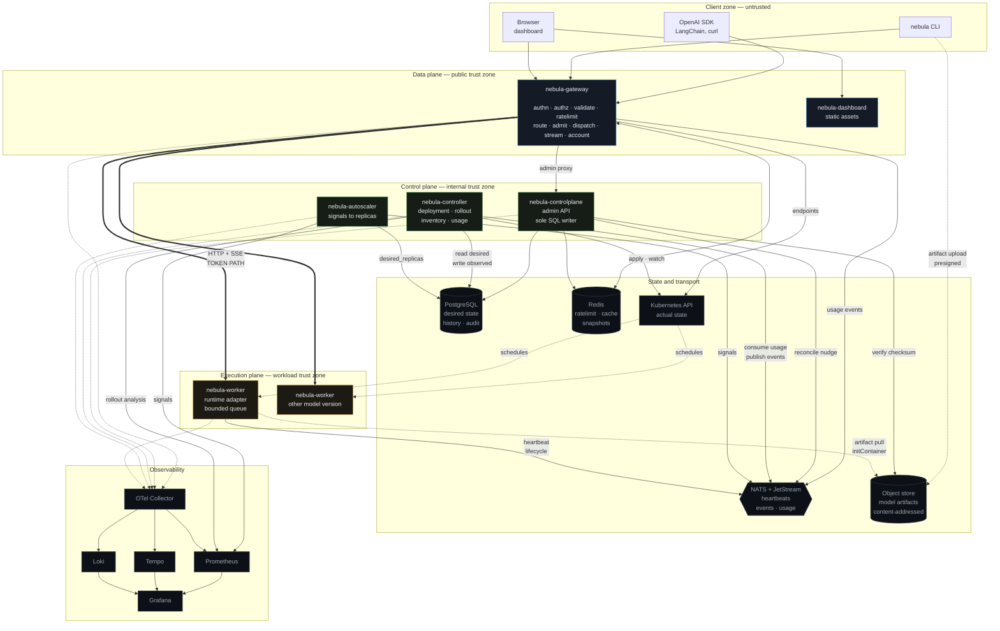

Thick edges are the token path. Dotted edges are asynchronous or optional. The gateway is the only
component in two zones at once, which is exactly why it is where authentication, rate limiting, and
tenant scoping live — one edge, one place to get isolation right.

Plain-text version: [architecture.md §5](./architecture.md#5-architecture-diagram).

---

## 2. Component diagram

Processes with their internal libraries shown, because "which process is this code in" is the question
the service list does not answer. Libraries appear in every process that consumes them — that is the
point of a library, and the reason the boxes repeat.

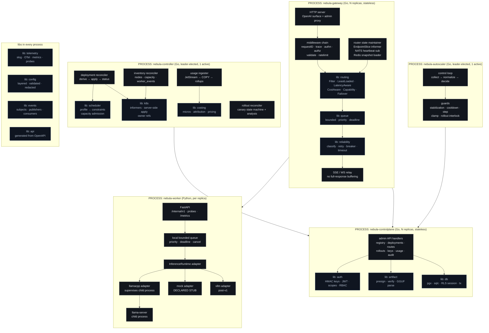

The five I/O-free libraries — `routing`, `queue`, `reliability`, `scheduler`, `costing` — hold the logic
most likely to be wrong, which is why they are pure: they are testable under an injected clock with no
cluster, which matters a great deal given [risk R-01](./risk-register.md).

---

## 3. Request lifecycle

Streaming chat completion, the hot path. Timings are illustrative of shape, not measured.

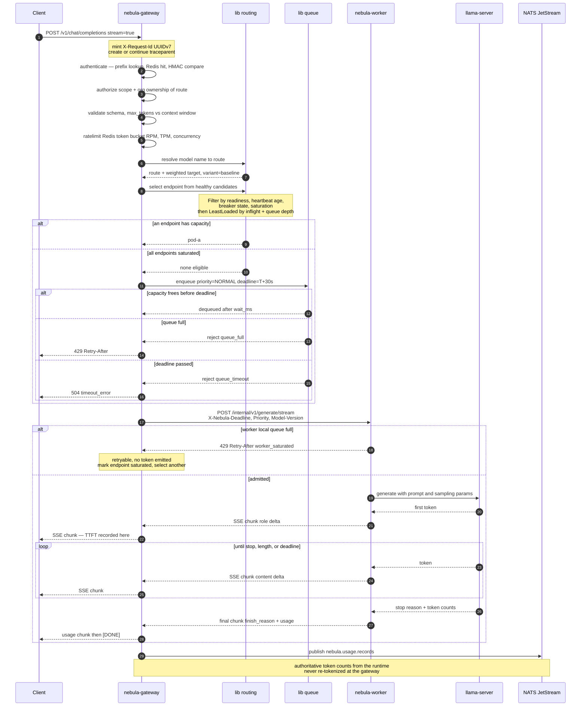

### 3.1 Stage budget and failure behaviour

| # | Stage | Owner | Typical | Failure → client sees |
|---|-------|-------|---------|----------------------|
| 1 | accept + identify | gateway | <1 ms | — |
| 2 | authenticate | `lib auth` + Redis | ~1 ms cached | 401 `authentication_error` |
| 3 | authorize | `lib auth` | <1 ms | 403, or 404 for out-of-org (no existence leak) |
| 4 | validate | gateway | <1 ms | 400 with the offending `param` named |
| 5 | rate limit | Redis Lua | ~1 ms | 429 + `Retry-After`, `X-Nebula-Reason` |
| 6 | resolve route | `lib routing` | <0.1 ms | 404 unknown model |
| 7 | select endpoint | `lib routing` | <0.1 ms | 503 `no_healthy_endpoint` |
| 8 | admission queue | `lib queue` | 0 ms when healthy | 429 `queue_full` or 504 `queue_timeout` |
| 9 | dispatch | `lib reliability` | ~1 ms | retry, then 502/503 — never after a token |
| 10 | prefill | runtime | tens–hundreds ms | 504 on TTFT timeout |
| 11 | decode | runtime | tokens/sec bound | mid-stream error frame, no `finish_reason` |
| 12 | account | `lib events` | async | never visible; drops are counted, not silent |

**The rule that shapes stage 9:** once a token has reached the client, no retry is possible — an HTTP
body cannot be un-sent ([ADR-0013](./architecture-decisions/README.md#adr-0013)).

---

## 4. Deployment lifecycle

### 4.1 Create and reconcile

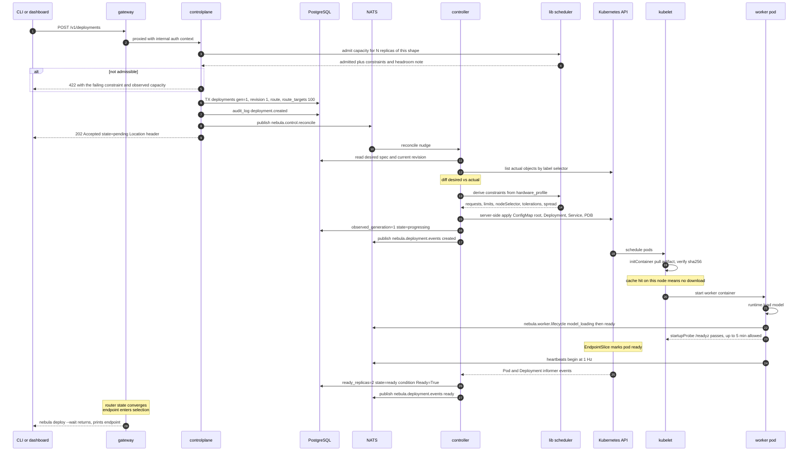

### 4.2 Deployment state machine

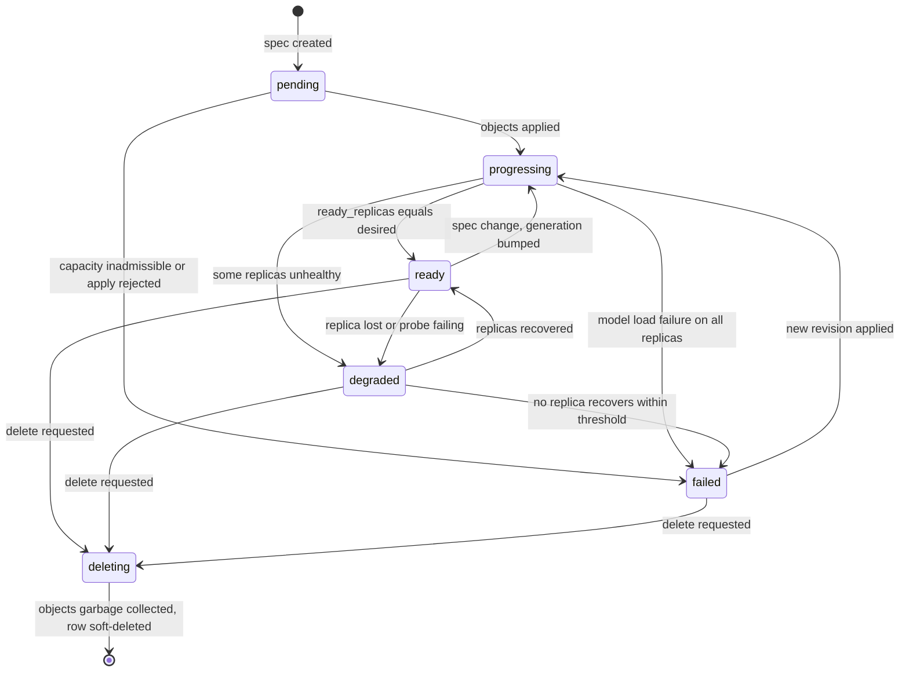

`generation` changes only on a spec change and never on a status write — the single rule that makes
`generation <> observed_generation` a trustworthy "work to do" predicate.

### 4.3 Scale, rollback, and canary as the same mechanism

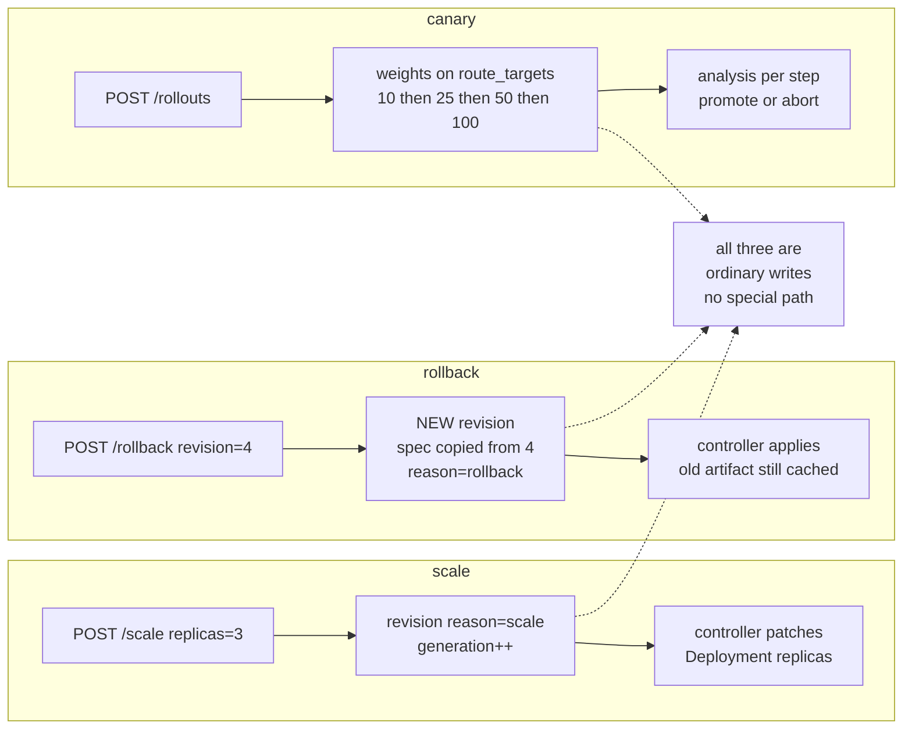

History is never rewritten: a rollback appends a revision rather than restoring one, which is what
makes an incident reviewable afterwards.

---

## 5. Model registration lifecycle

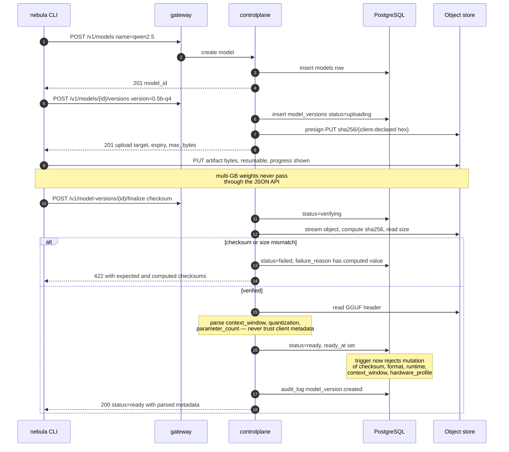

### 5.1 Model version state machine

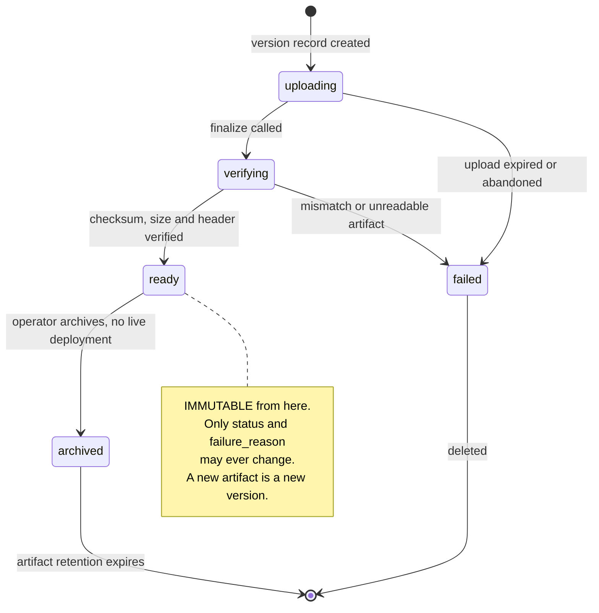

### 5.2 Artifact flow across the cluster

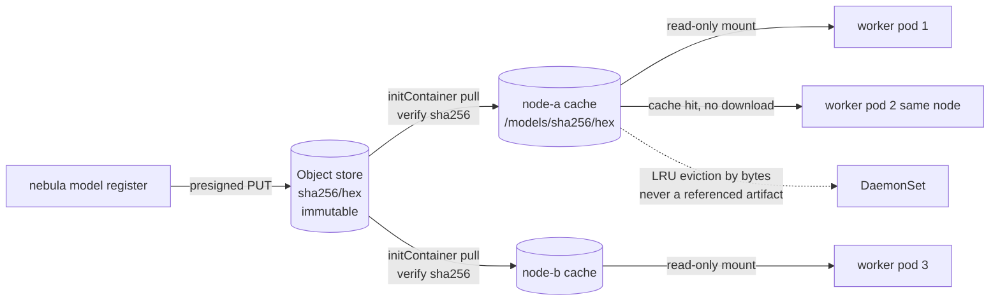

Content addressing is what makes the cache key provably correct, deduplicates identical artifacts, and
makes rollback free — the previous version's bytes are still on the node.

---

## 6. Failure and recovery flows

### 6.1 Worker OOMKilled mid-stream

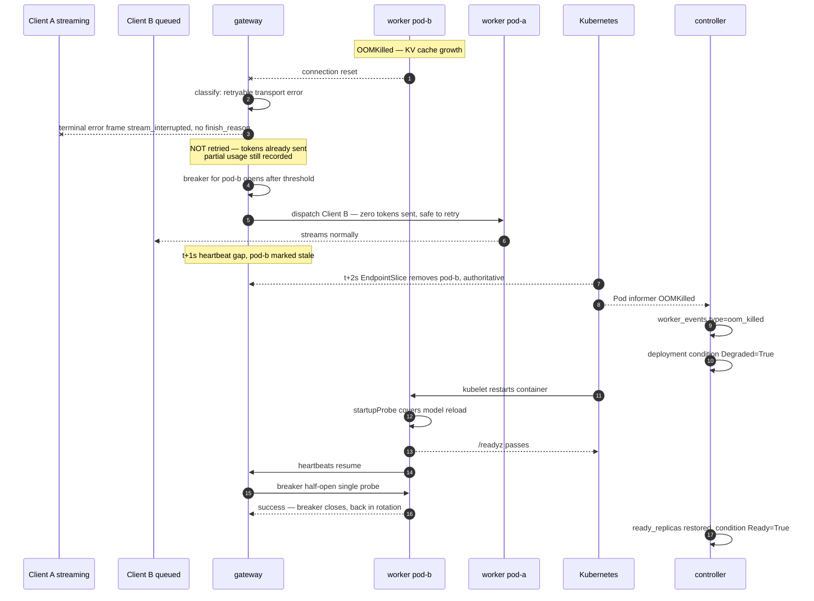

Recovery is automatic at every step. The one user-visible cost is Client A's interrupted stream, which
is inherent to streaming rather than a gap in the design ([risk R-08](./risk-register.md)).

### 6.2 Canary rollout aborting on a metric breach

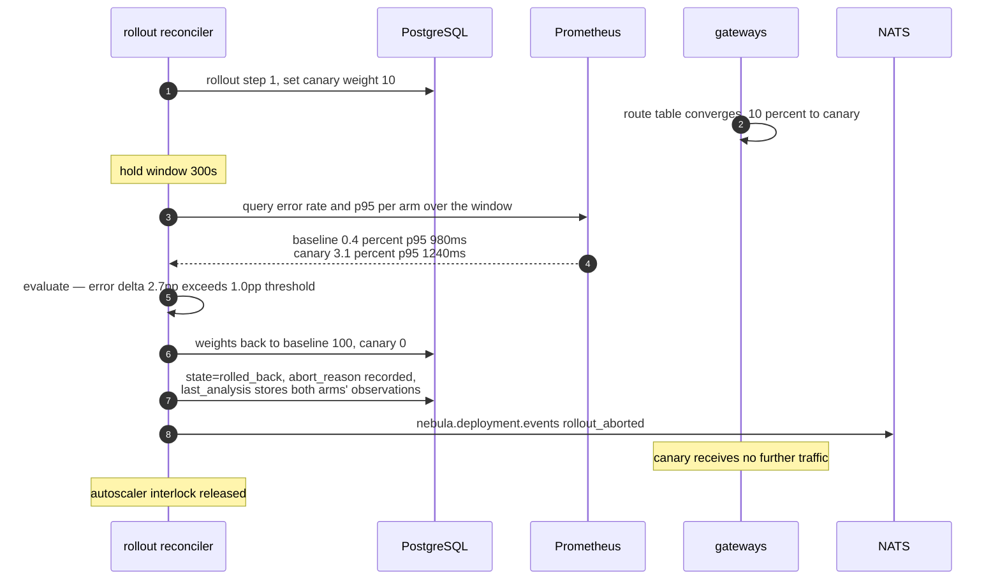

If the window sees fewer than `min_requests`, the step does **not** pass: it extends, pauses, or fails
per the configured `on_insufficient_data` policy. Promoting on forty requests would be theatre
([risk R-13](./risk-register.md)).

### 6.3 Dependency outage decision flow

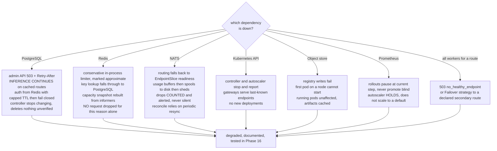

The pattern across all seven: **inference degrades last**. Every branch is a Phase 16 failure test, so
these are assertions rather than intentions.

---

## 7. Database ER diagram

Abbreviated attributes — full DDL with constraints, triggers, partitions, and RLS policies is in
[data-model.md](./data-model.md).

```mermaid
erDiagram
    ORGANIZATIONS ||--o{ USERS : employs
    ORGANIZATIONS ||--o{ API_KEYS : owns
    ORGANIZATIONS ||--o{ MODELS : owns
    ORGANIZATIONS ||--o{ DEPLOYMENTS : owns
    ORGANIZATIONS ||--o{ ROUTES : owns
    ORGANIZATIONS ||--o{ USAGE_RECORDS : accrues
    ORGANIZATIONS ||--o{ AUDIT_LOGS : records
    ORGANIZATIONS }o--|| PRICING_PROFILES : "priced by"
    USERS ||--o{ API_KEYS : created
    MODELS ||--o{ MODEL_VERSIONS : "has versions"
    MODEL_VERSIONS ||--o{ MODEL_ARTIFACTS : "consists of"
    MODEL_VERSIONS ||--o{ DEPLOYMENTS : "pinned by"
    DEPLOYMENTS ||--o{ DEPLOYMENT_REVISIONS : "snapshotted as"
    DEPLOYMENTS ||--o{ AUTOSCALING_EVENTS : "decisions for"
    DEPLOYMENTS ||--o{ WORKER_EVENTS : "history for"
    ROUTES ||--o{ ROUTE_TARGETS : "splits across"
    DEPLOYMENTS ||--o{ ROUTE_TARGETS : "targeted by"
    ROUTES ||--o{ CANARY_ROLLOUTS : "rolled out on"
    ROUTES ||--o{ EXPERIMENTS : "tested on"
    ROUTING_POLICIES ||--o{ ROUTES : governs
    ROUTING_POLICIES ||--o{ DEPLOYMENTS : governs
    RATE_LIMIT_POLICIES ||--o{ API_KEYS : limits
    PRICING_PROFILES ||--o{ USAGE_RECORDS : "priced with"
    REQUESTS }o--|| USAGE_RECORDS : "rolled up into"

    ORGANIZATIONS {
        uuid id PK
        text slug UK "DNS label — used in k8s names"
        jsonb quota
        uuid pricing_profile_id FK
    }
    USERS {
        uuid id PK
        uuid org_id FK
        text email UK
        user_role role "owner admin developer viewer"
        text password_hash "argon2id, null if OIDC"
    }
    API_KEYS {
        uuid id PK
        uuid org_id FK
        char prefix UK "nbk_ plus 7 — safe to display"
        bytea key_hash "HMAC-SHA256 with pepper"
        text_array scopes
        text priority "LOW NORMAL HIGH — not client-settable"
        timestamptz revoked_at
    }
    MODELS {
        uuid id PK
        uuid org_id FK
        text name "unique per org"
        text task "chat completion embedding"
    }
    MODEL_VERSIONS {
        uuid id PK
        uuid model_id FK
        text version "unique per model"
        text format "gguf safetensors mock"
        text runtime "llamacpp vllm mock"
        bytea checksum_sha256
        integer context_window
        jsonb hardware_profile
        model_version_status status "IMMUTABLE once ready"
    }
    MODEL_ARTIFACTS {
        uuid id PK
        uuid model_version_id FK
        text path
        bytea checksum_sha256
    }
    DEPLOYMENTS {
        uuid id PK
        uuid org_id FK
        uuid model_version_id FK
        text name "unique per org"
        integer desired_replicas "written by autoscaler"
        jsonb resources
        bigint generation "spec changes only"
        bigint observed_generation "controller writes"
        deployment_state state "OBSERVED"
        integer ready_replicas "OBSERVED"
    }
    DEPLOYMENT_REVISIONS {
        uuid id PK
        uuid deployment_id FK
        integer revision UK
        jsonb spec "immutable snapshot"
        bytea spec_hash
        text reason "create update scale rollback rollout"
    }
    ROUTES {
        uuid id PK
        uuid org_id FK
        text model_name UK "what clients send"
    }
    ROUTE_TARGETS {
        uuid id PK
        uuid route_id FK
        uuid deployment_id FK
        integer weight "must sum to 100 per route"
        boolean is_baseline
    }
    CANARY_ROLLOUTS {
        uuid id PK
        uuid route_id FK
        uuid baseline_deployment_id FK
        uuid canary_deployment_id FK
        jsonb steps
        jsonb analysis "thresholds and min_requests"
        rollout_state state "one active per route"
        jsonb last_analysis "per-arm observations"
    }
    EXPERIMENTS {
        uuid id PK
        uuid route_id FK
        text bucketing "request sticky_user sticky_org"
        experiment_state state
    }
    ROUTING_POLICIES {
        uuid id PK
        text strategy "text not enum — strategies are plugins"
        jsonb config
    }
    RATE_LIMIT_POLICIES {
        uuid id PK
        integer requests_per_minute
        integer tokens_per_minute
        integer max_concurrency
        integer max_queue_depth
    }
    REQUESTS {
        uuid id PK "partitioned by created_at, no FKs"
        uuid org_id
        integer ttft_ms
        integer queue_wait_ms
        integer prompt_tokens
        integer completion_tokens
        text error_class
        text trace_id
    }
    USAGE_RECORDS {
        uuid id PK
        timestamptz bucket_hour UK
        bigint prompt_tokens
        bigint completion_tokens
        real sample_rate "for correction, not guessing"
        uuid pricing_profile_id FK
        bigint estimated_cost_micros
    }
    PRICING_PROFILES {
        uuid id PK
        integer version UK "IMMUTABLE, effective_from"
        bigint cpu_core_hour_micros
        jsonb gpu_hour_micros
    }
    NODES {
        uuid id PK
        text name UK "OBSERVED cache of k8s Node"
        jsonb capacity
        timestamptz synced_at
    }
    WORKER_EVENTS {
        uuid id PK
        uuid deployment_id FK
        text event_type "oom_killed model_load_failed etc"
        timestamptz occurred_at
    }
    AUTOSCALING_EVENTS {
        uuid id PK
        uuid deployment_id FK
        jsonb signals "full vector"
        text decision "includes suppressed_ reasons"
    }
    AUDIT_LOGS {
        uuid id PK "partitioned, INSERT and SELECT only"
        text action
        jsonb before
        jsonb after
        uuid request_id
    }
```

Three things this diagram is designed to show at a glance: **`REQUESTS` has no foreign keys** (hot-path
insert throughput, and a parent row must remain droppable); **`NODES` connects to nothing** (it is an
observed cache, not a modelled entity); and the `ROUTES → ROUTE_TARGETS → DEPLOYMENTS → MODEL_VERSIONS`
chain is what makes canary and rollback ordinary weight updates
([ADR-0009](./architecture-decisions/README.md#adr-0009)).

---

## 8. Kubernetes architecture

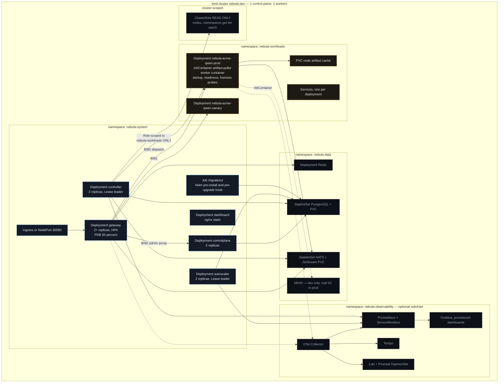

### 8.1 The boundary that matters

```
nebula-controller's write permissions:  Role in nebula-workloads  ONLY
                                        ─────────────────────────────
  deployments, services, configmaps, PDBs, PVCs   create/update/patch/delete
  pods, pods/log                                  read
  events                                          create/patch

  ClusterRole:  nodes, namespaces  →  get/list/watch  (READ ONLY)
  Role in nebula-system:  leases  →  get/create/update  (leader election)

  NOT granted, deliberately:
    secrets                  → cannot read credentials it does not own
    clusterroles/bindings    → no privilege-escalation path
    pods/exec, portforward   → no shell into a workload
    nodes (write)            → cannot cordon or taint
    deployments in nebula-system → CANNOT MODIFY NEBULA ITSELF
```

That last line removes a whole class of self-destruction bug: the controller physically cannot roll,
scale, or delete the control plane. CI asserts each negative with `kubectl auth can-i`, because an
RBAC intention nobody tested is an RBAC hope.

### 8.2 Probe strategy

Three probes answer three different questions, and conflating them is the classic failure:

| Probe | Question | Endpoint | Config | Consequence of getting it wrong |
|-------|----------|----------|--------|---------------------------------|
| `startupProbe` | has it finished loading? | `/readyz` | period 5 s, failureThreshold 60 → 5 min | too strict: a pod with a slow model load is killed forever |
| `readinessProbe` | should it receive traffic? | `/readyz` | period 5 s, threshold 3 | too loose: traffic to a pod whose model is not loaded |
| `livenessProbe` | is the process wedged? | `/livez` — **never checks dependencies** | period 10 s, threshold 3 | checking dependencies here turns a Postgres blip into a cluster-wide restart storm |

---

## 9. Service dependency graph

Solid = hard dependency (cannot serve its purpose without it). Dashed = soft (degrades, keeps working).

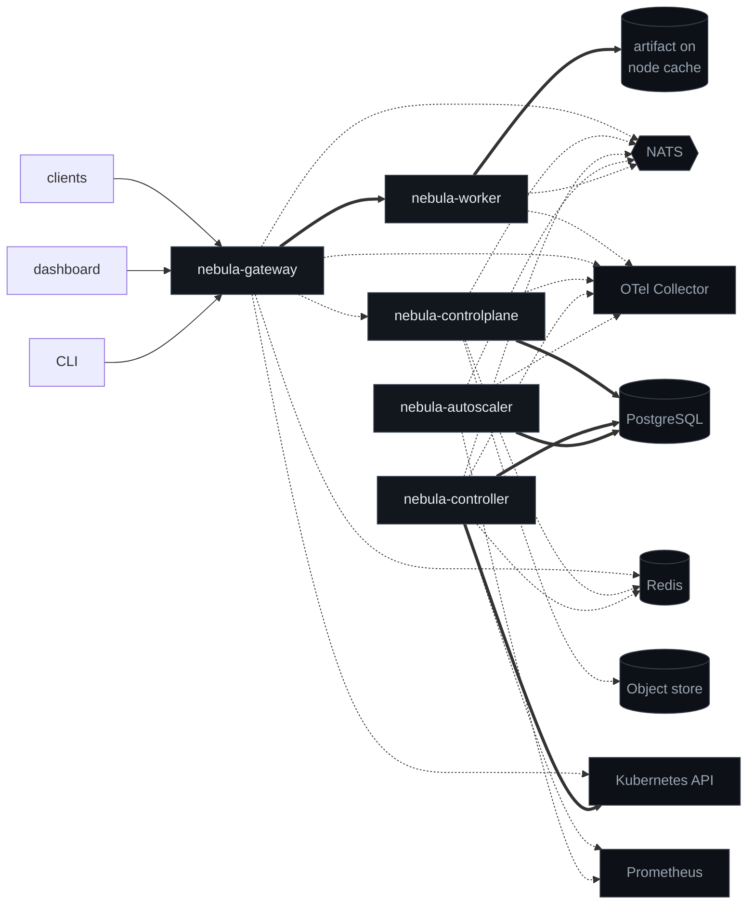

### 9.1 Dependency matrix

`H` hard · `S` soft · `—` none. Read a row as "what this component needs".

| ↓ needs → | Postgres | Redis | NATS | K8s API | Object store | Prometheus | OTel | gateway | controlplane | worker |
|-----------|----------|-------|------|---------|--------------|------------|------|---------|--------------|--------|
| **gateway** | — | S | S | S | — | S | S | — | S | **H** |
| **controlplane** | **H** | S | S | — | S | S | S | — | — | — |
| **controller** | **H** | S | S | **H** | — | S | S | — | — | — |
| **autoscaler** | **H** | — | S | — | — | S | S | — | — | — |
| **worker** | — | — | S | — | S¹ | — | S | — | — | — |
| **dashboard** | — | — | — | — | — | — | — | **H** | — | — |
| **CLI** | — | — | — | — | S | — | — | **H** | — | — |

¹ at pod startup only, via the initContainer; a running worker needs nothing from the object store.

### 9.2 Properties this graph is designed to have

1. **No cycles.** The gateway proxies to the control plane but the control plane never calls the
   gateway; the controller writes Kubernetes objects but never calls a worker.
2. **The worker depends on almost nothing.** No database, no Redis, no control plane — and those are
   *denied by NetworkPolicy*, not merely unused. The least trusted component has the smallest reach.
3. **Exactly one hard dependency sits on the token path**: gateway → worker. Everything else the
   gateway touches is soft, which is the mechanical form of axiom A8.
4. **PostgreSQL is hard for all three control-plane services and soft for none of the data plane.** A
   database outage is a change-freeze, not an outage.
5. **Nothing depends on the dashboard.** It is a leaf, so it can be removed, rebuilt, or broken without
   consequence elsewhere.
