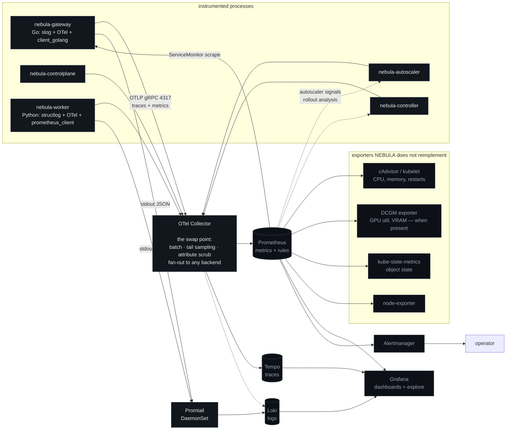

# NEBULA — Observability Architecture

**Status:** implemented in Phase 8 for everything whose metrics exist
([ADR-0035](./architecture-decisions/0035-observability-wiring.md)); rows and dashboards marked for later
phases arrive with them. Phase 18 adds runbooks. This document is the contract
those phases build against.

The requirement behind "distributed tracing" is not *having spans*. It is that an operator holding one
`request_id` can move from a Grafana panel to that request's trace to that request's logs without
guessing. Everything below exists to make that one move work.

---

## 1. Pipeline



Three properties this shape is chosen for:

1. **The Collector is the swap point.** Service code imports only the OpenTelemetry *API* and
   `prometheus/client_golang`. No vendor exporter is linked into a binary, so an operator with Datadog
   or Honeycomb changes Collector configuration, not application code
   ([ADR-0020](./architecture-decisions/README.md#adr-0020)).
2. **NEBULA does not re-publish numbers Kubernetes already publishes.** CPU, memory, restarts, and GPU
   utilization come from cAdvisor, kube-state-metrics, and DCGM. A NEBULA-maintained copy would
   eventually disagree with the source, and then two dashboards would show two truths (axiom A2).
3. **Telemetry never blocks the request path.** Every exporter has a bounded buffer and drops with a
   counter when full. An observability outage degrades observability, nothing else.

### 1.1 Prometheus is in the control loop

Worth stating explicitly because it changes Prometheus's criticality: the autoscaler reads it for
secondary signals and the rollout reconciler reads it for canary analysis. Both are designed to fail
**safe** rather than fail open — the autoscaler *holds* on missing signals rather than scaling to a
default, and a rollout *pauses at its current step* rather than promoting on absent data. A monitoring
outage must never become a traffic-shifting event.

---

## 2. Metric catalogue

Rows marked *(Phase N)* are planned and arrive with that phase; every other row is exported today
and asserted by `packages/telemetry` (`TestCatalogMatchesTheDocumentedCatalogue`).

Naming: `nebula_<subsystem>_<thing>_<unit>`, seconds and bytes as base units, `_total` on counters,
histograms for anything whose distribution matters. Every metric below is asserted to exist with its
documented labels by a Phase 8 contract test — otherwise a rename silently empties a dashboard and
nobody notices until an incident.

### 2.1 Request path (gateway)

| Metric | Type | Labels | Purpose |
|--------|------|--------|---------|
| `nebula_requests_total` | counter | `route`, `deployment`, `model_version`, `endpoint`, `status_class`, `error_class`, `variant` | RED: rate and errors |
| `nebula_request_duration_seconds` | histogram | `route`, `deployment`, `endpoint`, `streamed` | latency p50/p95/p99 |
| `nebula_ttft_seconds` | histogram | `route`, `deployment`, `model_version` | **the metric users feel**; separate from total duration because total duration is dominated by output length |
| `nebula_tokens_total` | counter | `direction` (prompt\|completion), `deployment`, `model_version` | throughput and billing cross-check |
| `nebula_tokens_per_second` | histogram | `deployment`, `model_version` | decode throughput per request |
| `nebula_inflight_requests` | gauge | `deployment` | HPA input; concurrency |
| `nebula_request_attempts_total` | counter | `deployment`, `outcome` | retry amplification |
| `nebula_streams_interrupted_total` | counter | `deployment`, `reason` | the cost of [risk R-08](./risk-register.md), made visible |
| `nebula_client_cancellations_total` | counter | `deployment` | not an SLO violation; must be excluded from error rate |

`status_class` (`2xx`/`4xx`/`5xx`) is a label; the exact status code is not, to bound cardinality.
`error_class` is the closed set from the classification table.

### 2.2 Routing, queue, reliability

| Metric | Type | Labels | Purpose |
|--------|------|--------|---------|
| `nebula_route_decisions_total` | counter | `route`, `strategy`, `outcome` | did routing find an endpoint |
| `nebula_endpoints` | gauge | `deployment`, `state` (ready\|not_ready\|stale\|not_accepting\|breaker_open\|saturated) | the router's own view of health |
| `nebula_endpoint_staleness_seconds` | histogram | `deployment` | heartbeat freshness — the leading indicator for [risk R-04](./risk-register.md) |
| `nebula_queue_depth` | gauge | `deployment`, `priority` | **primary autoscaling signal** |
| `nebula_queue_wait_seconds` | histogram | `deployment`, `priority` | user-visible queueing pain |
| `nebula_queue_oldest_age_seconds` | gauge | `deployment` | starvation detection |
| `nebula_queue_drops_total` | counter | `deployment`, `reason` (queue_full\|queue_timeout\|client_cancelled\|rejected) | shedding behaviour |
| `nebula_retries_total` *(Phase 10)* | counter | `deployment`, `reason` | retry volume |
| `nebula_retries_rejected_budget_total` *(Phase 10)* | counter | `deployment` | the budget doing its job |
| `nebula_breaker_state` | gauge | `deployment`, `endpoint`, `pod` | 0 closed, 1 half-open, 2 open — labelled by gateway pod because breakers are per-replica ([ADR-0014](./architecture-decisions/README.md#adr-0014)) |
| `nebula_ratelimit_rejections_total` | counter | `scope` (key\|org), `limit` (rpm\|tpm\|concurrency) | quota pressure |

### 2.3 Worker and runtime

Implemented in Phase 3 (`workers/inference/nebula_worker/telemetry.py`). The names below are what the
worker actually exports; where Phase 0 planned a different name, this table is the one that matches the
code.

| Metric | Type | Labels | Purpose |
|--------|------|--------|---------|
| `nebula_worker_requests_total` | counter | `endpoint`, `outcome` | traffic and how it ended |
| `nebula_worker_admission_rejected_total` | counter | `reason` | admission control working |
| `nebula_worker_request_duration_seconds` | histogram | — | end-to-end generation duration |
| `nebula_worker_ttft_seconds` | histogram | — | time to first token, observed at the first token |
| `nebula_worker_queue_wait_seconds` | histogram | — | user-visible queueing pain, at the worker |
| `nebula_worker_tokens_generated_total` / `_prompt_total` | counter | — | tokens, counted by the engine's tokenizer |
| `nebula_worker_cancellations_total` | counter | — | cancels honoured |
| `nebula_worker_deadlines_exceeded_total` | counter | — | requests that ran out of budget |
| `nebula_worker_model_load_duration_seconds` | histogram | — | cold-start cost |
| `nebula_worker_in_flight` | gauge | — | generations running now |
| `nebula_worker_queue_depth` | gauge | — | second-tier queue |
| `nebula_worker_slots_total` / `_busy` | gauge | — | runtime saturation |
| `nebula_worker_model_ready` | gauge | — | a model is loaded and the engine answers |
| `nebula_worker_engine_process_alive` | gauge | — | the engine child is running |
| `nebula_worker_draining` | gauge | — | 1 once draining has begun |
| `nebula_worker_engine_restarts` | gauge | — | times the adapter restarted the engine |
| `nebula_worker_kv_cache_used_bytes` | gauge | — | KV cache in use, **absent unless the engine reports it** |

Three deliberate departures from the Phase 0 sketch, each for a reason:

**No `deployment`, `pod` or `model_version` labels on worker metrics.** Those identify the *target*, not
the measurement, and Prometheus service discovery already attaches them at scrape time. Emitting them
from inside the process duplicates that, doubles cardinality when the two disagree, and makes a metric
wrong after a rollout rather than merely stale.

**`nebula_worker_up` does not exist; two gauges replace it.** `nebula_worker_engine_process_alive` and
`nebula_worker_model_ready` answer different questions, exactly as `/livez` and `/readyz` do
(obligation 6). A single `up` gauge cannot distinguish "the engine died" from "the model is still
loading", and those have different runbooks.

**`nebula_worker_kv_cache_used_bytes` is absent rather than zero when unknown.** The pinned llama.cpp
build exposes token counters, throughput and busy-slot averages, but nothing about KV-cache occupancy;
`/slots` reports only `is_processing` and each slot's `n_ctx`. An always-zero gauge would tell an
operator there is KV cache to spare while a worker OOMs, which is the "fake metrics" failure in
miniature. The series simply does not appear until an engine reports the number.

Still to come: `cache` (hit|miss) on load duration, `nebula_model_load_failures_total` by error class,
and `nebula_artifact_pull_duration_seconds` all belong to the artifact-pull path, which arrives with the
controller in Phase 5. They are not listed as implemented because they are not.

Where `llama-server` does not expose something NEBULA needs, the adapter times its own calls and the
metric is documented as **adapter-measured rather than engine-reported**. Presenting an adapter estimate
as an engine measurement would be the "fake metrics" failure at small scale (see the
[watch list](./risk-register.md#watch-list)).

### 2.4 Control plane

| Metric | Type | Labels | Purpose |
|--------|------|--------|---------|
| `nebula_reconcile_duration_seconds` | histogram | `reconciler`, `result` | control-loop health |
| `nebula_reconcile_errors_total` | counter | `reconciler`, `error_class` | persistent reconcile failure |
| `nebula_reconcile_queue_depth` | gauge | `reconciler` | backlog |
| `nebula_generation_lag` | gauge | `deployment` | `generation − observed_generation`: **the single best "is the control plane keeping up" metric** |
| `nebula_deployment_replicas` | gauge | `deployment`, `state` (desired\|ready\|updated) | convergence |
| `nebula_deployment_state` | gauge | `deployment`, `state` | fleet health |
| `nebula_autoscale_decisions_total` *(Phase 9)* | counter | `deployment`, `direction`, `decision` | includes `suppressed_*`, which is what makes non-action diagnosable |
| `nebula_autoscale_signal_ratio` *(Phase 9)* | gauge | `deployment`, `signal` | why it scaled |
| `nebula_rollout_step` / `nebula_rollout_state` *(Phase 12)* | gauge | `route`, `rollout` | progressive delivery position |
| `nebula_capacity_admission_total` | counter | `result` (admitted\|rejected), `reason` | placement rejections |
| `nebula_usage_events_dropped_total` *(Phase 13)* | counter | `reason` | **must stay zero**; non-zero means cost data is incomplete |
| `nebula_usage_ingest_lag_seconds` *(Phase 13)* | gauge | — | JetStream consumer backlog age |
| `nebula_estimated_cost_micros_total` *(Phase 13)* | counter | `org`, `deployment` | cost rate |
| `nebula_schema_version` | gauge | `service` | catches partial upgrades |

### 2.5 Cardinality budget

Stated as a budget because unbounded cardinality is how a monitoring stack dies, and it dies during the
incident you needed it for.

| Label | Bound | Rule |
|-------|-------|------|
| `org` | tens | On aggregate counters only. **Never** on histograms. |
| `route`, `deployment`, `model_version` | tens–hundreds | Fine. |
| `pod` | ~hundreds | Only on worker and breaker metrics, never on request histograms. |
| `request_id`, `trace_id`, `api_key_id`, `user`, `prompt` | — | **Never a metric label.** These belong in logs and traces. |
| `error_class`, `reason`, `decision` | closed sets | Enumerated in code, so a typo cannot invent a series. |
| `status_code` | — | Replaced by `status_class`. |

A lint rule in `packages/telemetry` rejects registration of a metric whose label set is not declared,
so this budget is enforced at compile time rather than discovered in Prometheus's memory graph.

---

## 3. Tracing

### 3.1 Span model

```
gateway.request                          route, org, api_key_prefix, endpoint, streamed
├── gateway.authenticate                 auth_method, cache_hit
├── gateway.ratelimit                    limit_type, remaining
├── gateway.validate
├── router.resolve                       route_id, target_deployment, weight, variant, bucketing_key_hash
├── router.select                        strategy_chain, candidates_considered, candidates_filtered,
│                                        filter_reasons, chosen_pod
├── queue.wait                  (only when enqueued) priority, deadline_ms, wait_ms, position_at_entry
└── dispatch.attempt            (one span per attempt) attempt, endpoint, breaker_state
    └── worker.generate          [SERVER span, remote]  model_version, runtime, slot
        ├── worker.queue                  local queue wait
        ├── runtime.load        (cold start only) cache_hit, load_ms, bytes
        └── runtime.stream                ttft_ms, tokens_out, tokens_per_second, finish_reason
```

Control-plane loops get their own traces, not children of a request:
`controller.reconcile` → `scheduler.derive_constraints` → `k8s.apply` → `status.writeback`;
`autoscaler.evaluate` → `signals.collect` → `decide`;
`rollout.step` → `analysis.query` → `weights.apply`.

### 3.2 Rules

- **W3C `traceparent`** accepted from clients and propagated everywhere, including into worker HTTP
  calls and NATS message headers, so an async consumer's work links back to the request that caused it.
- **Attributes never contain prompt or completion content.** Token *counts*, yes; token *text*, never.
- `request_id` is a span attribute on the root span **and** a field on every log line, which is the
  actual mechanism behind the metric → trace → logs move.
- **Sampling:** head sampling at a configurable rate (100% in dev, typically 1–10% in production), with
  tail sampling in the Collector that **always keeps** any trace containing an error, a retry, a queue
  wait above threshold, a breaker transition, a rollout step, or a total duration above the p99 target.
  Head sampling alone loses exactly the traces worth having.
- A span is closed on every path including cancellation, with `span.status` set — an unclosed span is a
  silent hole in a flame graph.

---

## 4. Logging

### 4.1 Schema

`log/slog` JSON in Go, `structlog` JSON in Python, stdout only. Mandatory fields on every line:

```json
{
  "ts": "2026-09-22T14:32:07.412Z", "level": "info",
  "msg": "dispatch completed",
  "service": "nebula-gateway", "version": "0.4.1+a1b2c3d", "instance": "gateway-7d9f-x2k",
  "request_id": "0192f3c1-7b5a-7c3e-9a11-0e5d2b8f4a21",
  "trace_id": "4bf92f3577b34da6a3ce929d0e0e4736", "span_id": "00f067aa0ba902b7",
  "org_id": "0192f3b0-...", "route": "qwen2.5-chat", "deployment": "qwen-prod",
  "model_version": "qwen2.5:0.5b-q4",
  "error_class": null, "duration_ms": 1320
}
```

### 4.2 Rules

| Rule | Reason |
|------|--------|
| Structured only; no `fmt.Println` in service code | Enforced by lint; an unstructured line is invisible to a query |
| **No prompt or completion content by default** | Most sensitive data in the system ([risk R-16](./risk-register.md)) |
| A single shared redaction helper is the only path that can write a request body | One place to audit, not every call site |
| Content logging is opt-in per org, time-bounded, retention-limited, and **audited when enabled** | Support needs it occasionally; nobody should be able to turn it on quietly |
| Levels: `error` needs action, `warn` may need action, `info` is a state change, `debug` is off in production | A log level that means nothing gets filtered out entirely, including the real errors |
| Loki labels are low-cardinality only: `service`, `level`, `namespace`, `pod` | `request_id` and `trace_id` live in the **body**, queried with `|=`. High-cardinality Loki labels are the classic way to make Loki unusable |
| One event, one line | Multi-line stack traces are collapsed into a field |

---

## 5. Correlation: the operator's path

The design target, and the Phase 8 exit criterion:

```
Grafana alert: p95 TTFT on qwen-prod breached
   │
   ├─ 1. Deployment Detail dashboard, panel filtered to deployment=qwen-prod
   │        → see queue_wait rising, endpoints gauge shows 1 of 3 breaker_open
   │
   ├─ 2. Exemplar on the histogram panel → trace_id → click through to Tempo
   │        → flame graph shows queue.wait 4.2s, dispatch.attempt ×2,
   │          first attempt to pod-b failed
   │
   ├─ 3. From the trace, Loki query: {service="nebula-gateway"} |= "<request_id>"
   │        → structured lines for classify, breaker open, reselect
   │
   ├─ 4. Same request_id against {service="nebula-worker", pod="pod-b"}
   │        → model_load_failed ChecksumMismatch
   │
   └─ 5. API: GET /v1/deployments/{id}/events → worker_events row persists the cause
            after the pod and its Kubernetes Events are long gone
```

Steps 2 and 3 are what **exemplars** exist for: Prometheus histogram buckets carry a sample `trace_id`,
which is the link from an aggregate to one concrete request. Without them, step 2 is a manual search
through traces by timestamp, which does not work under load.

Step 5 matters because Kubernetes Events expire in about an hour. A platform whose failure explanation
evaporates before the morning stand-up has not actually recorded anything.

---

## 6. Dashboards

Generated by `deploy/grafana/generate.py` into `deploy/helm/nebula/files/dashboards/` (`make
dashboards`; CI fails if the committed JSON differs from the generator), provisioned by the chart — version-controlled, so a
dashboard change is reviewable and a dashboard is never lost with a pod.

| Dashboard | Answers |
|-----------|---------|
| **Fleet Overview** | Is anything wrong right now? Request rate, error rate, p95 TTFT, deployments by state, SLO burn rate |
| **Deployment Detail** | What is wrong with *this* deployment? RED + queue + endpoints + replicas + model load + cost, with an events timeline |
| **Request Path** | Where is time going? Stage-by-stage latency breakdown, retry rate, breaker states, exemplar links |
| **Queue & Autoscaling** | Why is it slow, and why did (or didn't) it scale? Queue depth and wait against targets, the signal-ratio series, decisions including suppressions |
| **Rollouts & Experiments** | Should this be promoted? Per-arm error rate, latency, tokens/sec, cost per 1k tokens, current weights and step |
| **Cost** | What is this costing, and why? Cost rate by deployment and org, tokens per request, compute-seconds, with the pricing profile version shown |
| **Nodes & GPU** | Do we have capacity? Node capacity vs allocated, GPU utilization and VRAM (when present), placement rejections |

Every panel renders from a real series. There is no mock-data path in the production bundle, and a panel
with no data shows "no data" rather than a flat line implying zero — a zero and an absence are different
facts, and confusing them during an incident costs real time.

---

## 7. SLOs and alerts

### 7.1 SLOs

Defaults, configurable per deployment. Measured over 30-day rolling windows.

| SLO | Target | Measurement |
|-----|--------|-------------|
| Availability | 99.9% of requests not `5xx` | `4xx` excluded (client error); client cancellations excluded |
| TTFT | p95 < 1 s for CPU deployments of ≤1B params | `nebula_ttft_seconds` |
| Queue wait | p95 < 500 ms | `nebula_queue_wait_seconds` |
| Control-plane convergence | p95 `generation_lag` = 0 within 30 s | `nebula_generation_lag` |
| Usage completeness | 100% of usage events recorded | `nebula_usage_events_dropped_total == 0` |

Excluding client cancellations from availability is deliberate: a user who closes their terminal has not
experienced an outage, and counting it as one trains operators to ignore the alert.

### 7.2 Alerts

Grouped by what the operator should actually do, because an alert without an action is noise that
teaches people to ignore alerts.

| Alert | Condition | Severity | Action |
|-------|-----------|----------|--------|
| `NebulaSLOErrorBudgetBurn` | multi-window burn rate (1h and 6h) exceeding budget | page | investigate error class breakdown |
| `NebulaNoHealthyEndpoints` | `nebula_endpoints{state="ready"} == 0` for a deployment, 2 m | page | model load failure or node loss |
| `NebulaQueueSaturated` | `queue_depth` at max **and** drops increasing, 5 m | page | capacity; check autoscaler decisions |
| `NebulaTTFTHigh` | p95 TTFT > 2× target, 10 m | ticket | saturation or a slow endpoint |
| `NebulaUsageEventsDropped` | `increase(usage_events_dropped_total) > 0` | page | **cost data is now incomplete** — NATS or ingest |
| `NebulaUsageIngestLag` | `usage_ingest_lag_seconds > 300`, 15 m | ticket | consumer or database throughput |
| `NebulaReconcileFailing` | `reconcile_errors_total` rising, 10 m | page | control plane cannot converge |
| `NebulaGenerationLagStuck` | `generation_lag > 0` for 5 m on any deployment | ticket | reconciler wedged on one item |
| `NebulaBreakerOpen` | any breaker open > 5 m | ticket | an endpoint is persistently bad |
| `NebulaAutoscalerFlapping` | > 6 replica changes in 1 h on one deployment | ticket | tune windows ([risk R-05](./risk-register.md)) |
| `NebulaAutoscalerBlind` | `decision="suppressed_no_signal"` for 15 m | ticket | signal pipeline broken |
| `NebulaRolloutAborted` | state transition to `rolled_back` | notify | expected behaviour; inform, don't page |
| `NebulaModelLoadFailing` | `model_load_failures_total` rising | page | bad artifact or insufficient memory |
| `NebulaCapacityRejections` | `capacity_admission_total{result="rejected"}` rising | ticket | cluster needs nodes |
| `NebulaSchemaVersionSkew` | distinct `nebula_schema_version` values | page | partial upgrade — a correctness risk |

`NebulaRolloutAborted` is a notification, not a page, on purpose: an aborted canary is the system working
correctly. Paging for it would train people to promote through analysis failures.

---

## 8. Testing the observability itself

Observability that is not tested is decoration, and it fails exactly when it is needed. Phase 8 ships:

- **Metric contract test** — every metric in §2 exists with its documented name, type, and label set. A
  rename fails CI instead of silently emptying a dashboard.
- **Cardinality test** — a synthetic workload across many orgs, routes, and pods, asserting the series
  count stays within the §2.5 budget.
- **Trace completeness test** — one request produces the full expected span tree with the documented
  attributes; every span is closed, including on the cancellation path.
- **Log schema test** — every line carries the mandatory fields, and **no line contains prompt or
  completion content** by default.
- **Correlation test** — the §5 path is walked programmatically: metric exemplar → trace → log lines,
  for one known `request_id`.
- **Dashboard test** — every panel's query returns a non-error result against a seeded Prometheus, so a
  shipped dashboard cannot contain a broken query.
- **Alert rule test** — `promtool test rules` with synthetic series for each alert, asserting it fires
  when it should and, just as importantly, does not fire when it shouldn't.
