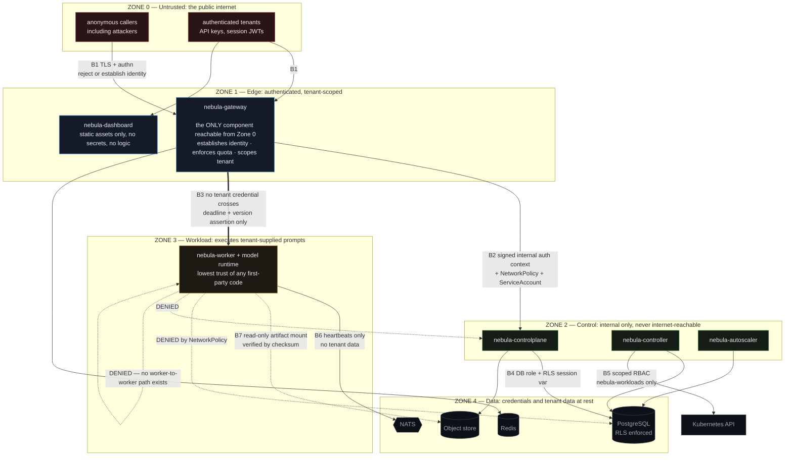
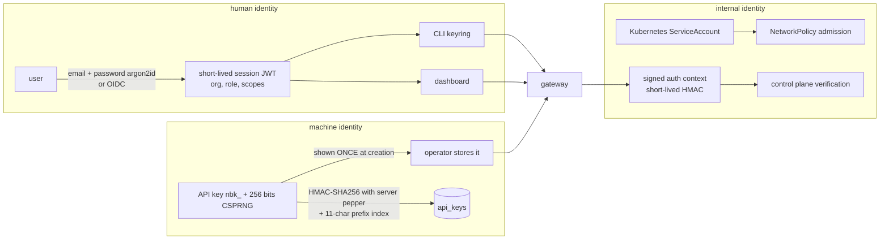

# NEBULA — Security Boundaries

**Status:** Phase 0 design. This document defines the boundaries and the model. The operational threat
model, the exhaustive authorization matrix, and the hardening checklist are written in Phase 17
(`docs/security.md`), which extends this rather than replacing it.

---

## 1. Trust zones

Every component sits in exactly one zone. A boundary crossing is where identity is established or
re-established, and every crossing is named below.



| Zone | Contains | Assumption |
|------|----------|------------|
| **0 — Untrusted** | all external callers | Every request is hostile until proven otherwise. Payloads are adversarial input. |
| **1 — Edge** | gateway, dashboard assets | Reachable from Zone 0. Holds no tenant data at rest. Establishes identity and is the single place tenant scoping is decided. |
| **2 — Control** | control plane, controller, autoscaler | Not internet-reachable. Trusts only the gateway's ServiceAccount, and verifies rather than assumes. |
| **3 — Workload** | workers and model runtimes | **Lowest trust of any first-party code**, because it processes tenant-supplied prompts inside a large native dependency tree. Given the least reach of anything in the system. |
| **4 — Data** | PostgreSQL, Redis, NATS, object store | Credentials and tenant data at rest. Reachable only from Zone 2 (and Redis/NATS from Zone 1). |

The zone ordering is deliberately *not* "inner is more trusted". Zone 3 sits between the control plane
and the data layer in the diagram but is trusted less than Zone 1 — because the worker runs
`llama-server` over bytes an attacker chose. A parser bug there must not become a database breach,
which is why the worker's NetworkPolicy denies PostgreSQL, the control plane, and other workers.

---

## 2. Boundary contracts

### B1 — Zone 0 → Zone 1: the public edge

**Enforced by the gateway, in this order, and the order is part of the design** — cheap rejections
happen before expensive work, so an unauthenticated flood never reaches the database or a model.

| Step | Control | Failure |
|------|---------|---------|
| 1 | TLS 1.2+ (cert-manager), HSTS, HTTP→HTTPS redirect | connection refused |
| 2 | Request size and header limits, body byte cap, read timeout | 413 / 400 |
| 3 | Credential parse — `nbk_` prefix → API key path, otherwise JWT path | 401 |
| 4 | API key: 11-char prefix lookup (Redis, 30 s TTL, then PostgreSQL) → **constant-time** HMAC-SHA256 compare against a pepper held only by the application | 401 `authentication_error` |
| 5 | Revocation and expiry check | 401 |
| 6 | Scope check against the endpoint's required scope | 403 `permission_error` |
| 7 | Tenant ownership: the requested route/resource belongs to the credential's org | **404**, never 403 — see §4.2 |
| 8 | Quota: RPM, TPM, concurrency, queue depth (Redis Lua, atomic) | 429 + `Retry-After` |
| 9 | Semantic validation: schema, `max_tokens` vs context window, parameter support | 400 naming the `param` |

What never crosses B1 **inward**: nothing is trusted. What never crosses B1 **outward**: pod names, node
names, internal hostnames, SQL detail, stack traces, upstream error bodies, or any other component's
existence. Public errors carry a stable `type`/`code` and a `request_id`; the detail goes to logs and
traces, which are operator-only.

### B2 — Zone 1 → Zone 2: the admin proxy

The control plane is never internet-reachable, so it must be certain that an "authenticated" request
really came from the gateway rather than from something else inside the cluster.

Three independent controls, because any one alone is weak:

1. **NetworkPolicy** — ingress to the control plane is allowed only from pods carrying the gateway's
   ServiceAccount label, in `nebula-system`. A compromised worker cannot open the connection at all.
2. **Signed internal auth context** — the gateway attaches `X-Nebula-Auth-Context`: org ID, actor,
   scopes, request ID, issued-at, and a short-lived HMAC signature over the whole thing. The control
   plane verifies the signature and rejects anything older than a few seconds. Replay is bounded; a
   forged context needs the shared secret.
3. **mTLS-ready** — cert-manager-issued certificates and a config flag, so the transport can be
   mutually authenticated without introducing a service mesh.

The control plane **never** re-derives identity from a client-supplied header on its own authority, and
**never** accepts an `org_id` as a request parameter. Org scope comes from the verified context only.
That single rule prevents the most common multi-tenant bug in systems of this shape.

### B3 — Zone 1 → Zone 3: dispatch to the worker

The most interesting boundary, because of what deliberately does *not* cross it.

**Crosses:** the prompt and sampling parameters; `X-Request-Id`; `traceparent`;
`X-Nebula-Deadline` (absolute ms); `X-Nebula-Priority`; `X-Nebula-Model-Version`.

**Does not cross:** the API key, the JWT, the org ID, the user's identity, any scope, or any database
credential. A worker cannot authenticate to anything, because it holds nothing to authenticate with. If
a model runtime is compromised by a malicious prompt, the attacker gains a process that can generate
tokens and reach NATS — not a credential.

The worker **rejects** a request missing a deadline, request ID, or trace context, rather than inventing
defaults. An untraced, deadline-less request can never enter the runtime; that is an availability
control as much as a security one, since a request with no deadline is a resource leak.

`X-Nebula-Model-Version` is asserted and verified: a mismatch is a 409. A stale router therefore cannot
silently serve the wrong model — which would be a correctness and, in a multi-version canary, an
attribution problem.

### B4 — Zone 2 → Zone 4: database access

Three PostgreSQL roles, granted by need rather than convenience:

| Role | Used by | Grants | RLS |
|------|---------|--------|-----|
| `nebula_app` | controlplane | CRUD on authoritative tables; **INSERT + SELECT only** on append-only tables | **enforced** |
| `nebula_controller` | controller, autoscaler | UPDATE on observed columns; INSERT on event tables; SELECT elsewhere | explicit, visible bypass — it works across orgs by design |
| `nebula_readonly` | analytics, ad-hoc inspection | SELECT only | enforced |

`audit_logs` has no UPDATE or DELETE grant for any application role. Append-only is a database
permission, not a coding convention — the difference being that a convention is one careless migration
away from not existing.

Row-level security is enforced on every org-scoped table, with the application setting
`SET LOCAL app.current_org` inside each request transaction
([ADR-0022](./architecture-decisions/README.md#adr-0022)). A forgotten `WHERE org_id = $1` yields an
empty result set instead of another tenant's rows.

### B5 — Zone 2 → Kubernetes API

Least privilege, with the negatives written down so a reviewer can check them and CI can assert them:

```
GRANTED
  Role in nebula-workloads   deployments, services, configmaps, PDBs, PVCs  create/update/patch/delete
                             pods, pods/log                                  read
                             events                                          create/patch
  ClusterRole                nodes, namespaces                               get/list/watch  (READ ONLY)
  Role in nebula-system      leases                                          get/create/update

DENIED — each asserted by a `kubectl auth can-i` negative test in CI
  secrets                       cannot read credentials it does not own
  clusterroles, rolebindings    no privilege-escalation path
  pods/exec, pods/portforward   no shell into a workload
  nodes (write)                 cannot cordon, taint, or drain
  deployments in nebula-system  CANNOT MODIFY NEBULA ITSELF
  anything in kube-system       no cluster-wide reach
```

The gateway gets `EndpointSlice` get/list/watch in `nebula-workloads` and nothing else. The control
plane and autoscaler get no Kubernetes access at all beyond leases. Every ServiceAccount sets
`automountServiceAccountToken: false` except where the API is genuinely used.

### B6 — Zone 3 → Zone 4: the worker's only outbound path

Workers publish heartbeats and lifecycle events to NATS. Heartbeat payloads carry pod identity, load
figures, and memory counters — **no prompts, no completions, no tenant identity beyond the deployment
ID** ([events.md §3.1](./events.md#31-nebulaworkerheartbeatdeploymentpod)).

Denied by NetworkPolicy, and verified by a test that proves the denial rather than assuming it:
PostgreSQL, Redis, the control plane, other workers, and general internet egress. A worker can reach
NATS, the OTel collector, DNS, and the object store (at startup, for its artifact). Nothing else.

### B7 — Artifact integrity

Model weights are the one large untrusted input NEBULA deliberately executes against, so integrity is
enforced twice:

1. At registration, the control plane computes the SHA-256 server-side and compares it with the
   client's declared value. A mismatch sets the version `failed` with the computed value recorded. The
   client's claim is evidence, not truth.
2. At pod startup, the initContainer re-verifies the checksum of the cached file before the worker
   starts, and writes a machine-readable result so a failure is a named condition rather than an opaque
   `CrashLoopBackOff`.

Artifacts are content-addressed (`sha256/<hex>`), so the cache key *is* the integrity check, and are
mounted **read-only**. General egress from workers is denied, so weights cannot come from anywhere but
the configured store.

---

## 3. Identity and credentials



| Credential | Lifetime | Storage | Revocation |
|------------|----------|---------|------------|
| User password | until changed | argon2id hash, PostgreSQL | password change |
| Session JWT | short (minutes to hours) | CLI OS keyring / browser memory | expiry; short lifetime *is* the revocation story |
| API key | until revoked or `expires_at` | HMAC-SHA256 + pepper; plaintext **never** stored | `revoked_at` + cache-invalidate event; 30 s worst-case window |
| Internal auth context | seconds | never stored | expiry |
| Database credentials | rotated by the operator | Kubernetes Secret, mounted as a file | Secret rotation + rollout |
| HMAC pepper | long-lived, rotatable | Kubernetes Secret | dual-verify migration window |

**Why HMAC and not argon2 for API keys.** Argon2id is correct for passwords, where the secret is
low-entropy and guessable, and where verification happens once per login. An API key is 256 bits of
CSPRNG output — brute force is not the threat model — and verification happens on *every inference
request*, where tens of milliseconds of KDF is a latency budget spent for nothing. The pepper means a
database dump alone does not yield verifiable hashes
([ADR-0011](./architecture-decisions/README.md#adr-0011)).

**Secret handling rules.** Secrets arrive as mounted files or environment variables, never as
command-line flags (flags leak into `ps` output and crash dumps). No secret value has a default in the
Helm chart, so an install that would create a well-known credential fails rather than succeeding
insecurely. `GET /healthz` reports effective configuration with secret values redacted. Nothing secret
enters Git, logs, traces, events, or the dashboard.

---

## 4. Authorization model

### 4.1 Roles and scopes

Two layers that must agree: **roles** for human identities, **scopes** for machine identities. A key's
scopes can never exceed what its creating user's role could grant.

| Role | Can |
|------|-----|
| `owner` | everything, plus billing and org deletion |
| `admin` | all resources, manage all API keys, pricing, policies |
| `developer` | deploy, scale, rollback, rollouts; manage own keys only |
| `viewer` | read resources, metrics, usage; no mutation, no key access |

| Scope | Grants |
|-------|--------|
| `inference:invoke` | the OpenAI-compatible endpoints |
| `inference:pin` | the `nebula.deployment_id` override, which bypasses weighting — separate because it can defeat a canary |
| `models:read` / `models:write` | registry |
| `deployments:read` / `deployments:write` | deployments, scale, rollback |
| `rollouts:write` | rollouts, experiments, route weights |
| `usage:read` / `audit:read` | usage and cost / audit logs |
| `admin` | keys, policies, pricing, nodes |

Phase 17 ships an exhaustive matrix test: **every endpoint × every role × in-org and out-of-org**. An
authorization model that is not tested combinatorially has holes nobody has found yet.

### 4.2 Tenant isolation

Four independent mechanisms, because this is the highest-impact failure the system could have
([risk R-15](./risk-register.md)):

1. **Query scoping** — every query filters on `org_id` from the verified auth context.
2. **Row-level security** — PostgreSQL policies on every org-scoped table, so a missed filter returns
   nothing instead of leaking.
3. **404 rather than 403 for out-of-org resources** — a 403 confirms the resource exists, which is an
   existence oracle an attacker can enumerate.
4. **No cross-org worker sharing in v1** — a deployment belongs to exactly one org. Sharing a process
   that holds KV cache across tenants is a side channel and a noisy-neighbour problem, and it is
   documented as a non-goal rather than quietly assumed safe.

Optional stronger isolation: `tenant_namespaces: true` places each org's workers in
`nebula-wl-<org-slug>` with per-namespace ResourceQuota, LimitRange, and NetworkPolicy. The namespace
computation is the same code path in both modes, so this is configuration rather than a rewrite.

### 4.3 The metrics-query surface

The dashboard needs Prometheus data, and PromQL has no notion of a tenant — any label matcher can read
any series. So the gateway exposes a **bounded** metrics endpoint, not a passthrough: a small allowlist
of query shapes, server-injected `org_id`/`deployment_id` label matchers, enforced time ranges and step
sizes, and query cost limits. Arbitrary PromQL from a browser would be both an injection surface and a
cross-tenant read ([ADR-0024](./architecture-decisions/README.md#adr-0024)).

---

## 5. Data protection

| Data | At rest | In transit | Retention |
|------|---------|------------|-----------|
| Prompts and completions | **not stored** | TLS to the client, in-cluster to the worker | not retained |
| Prompt/completion in logs | **never by default** | — | opt-in per-org debug flag: time-bounded, audited when enabled, retention-limited |
| Token counts, latencies | `requests` (partitioned) | — | 30 days default, configurable |
| Usage rollups | `usage_records` | — | indefinite |
| Audit log | `audit_logs`, append-only | — | indefinite |
| API key hashes | HMAC + pepper | — | until revoked |
| Model artifacts | object store, content-addressed | TLS, checksum-verified | until version archived |

Prompt content is the most sensitive data in an inference platform and the easiest thing to log
accidentally while debugging ([risk R-16](./risk-register.md)). Controls: content is never logged by
default; a single shared redaction helper is the only path that can write a request body anywhere; and a
secret-and-content scan runs over logs, traces, and API responses in the e2e suite, so a regression
fails CI instead of reaching a Loki index that someone has to purge.

---

## 6. Threat table

Design-time threats and their controls. Phase 17 extends this into a full threat model; the point of
having it now is that a control missing at design time is expensive to add later.

| # | Threat | Control | Residual |
|---|--------|---------|----------|
| T-01 | Stolen API key | Hashed storage; revocation with a 30 s cache window; `last_used_at` for detection; per-key rate limits bound the damage; audit trail attributes actions | 30 s revocation window; key rotation is the operator's responsibility |
| T-02 | Cross-tenant data access | Four mechanisms in §4.2; combinatorial authz tests; per-table RLS tests | Low |
| T-03 | Database dump exfiltration | HMAC + pepper means key hashes are not offline-verifiable; no plaintext secrets; no prompt content in the database | Usage metadata is exposed if the dump succeeds |
| T-04 | Compromised model runtime (malicious weights or a parser bug) | Worker holds no credentials; NetworkPolicy denies database, control plane, peers, and general egress; read-only root filesystem; non-root; artifact checksum verified twice | A compromised worker can still emit wrong tokens for its own deployment |
| T-05 | Prompt injection to exfiltrate other tenants' data | No cross-tenant sharing; the worker has no access to other tenants' anything; the model sees only its own request | Inherent to LLMs within one tenant's own data |
| T-06 | Resource exhaustion / DoS | Rate limits (RPM, TPM, concurrency); bounded queues that shed with `Retry-After`; absolute deadlines on every request; payload size caps; retry budget capped at 10% of traffic | A distributed attack still consumes admitted capacity |
| T-07 | Privilege escalation via the controller | No `secrets`, no `clusterroles`/`rolebindings`, no `pods/exec`; cannot modify `nebula-system`; negatives asserted in CI | Low |
| T-08 | Internal service impersonation | NetworkPolicy by ServiceAccount + signed short-lived auth context + mTLS-ready; control plane never internet-reachable | Requires the shared secret and in-cluster position |
| T-09 | Information disclosure through errors | Closed set of public error codes; no pod/node/SQL detail past the gateway; 404 for out-of-org | Timing differences remain theoretically observable |
| T-10 | Supply-chain compromise | Pinned lockfiles with hashes; `trivy` gating at High+ with justified allowlist entries; SBOM; `cosign` signatures; distroless static Go images; pinned `llama-server` digest | Medium and tracked — inherent to the ML dependency tree ([risk R-20](./risk-register.md)) |
| T-11 | Dev conveniences reaching production | `NEBULA_ENV=production` makes the mock runtime, dev seeding, debug endpoints, and default credentials **startup failures**, not warnings; `conftest` policies fail a chart lacking TLS, probes, resource requests, or non-root | Low ([risk R-17](./risk-register.md)) |
| T-12 | Audit tampering | No UPDATE/DELETE grant on `audit_logs` for any application role; append-only partitions | A database superuser can still alter history — out of scope, and stated |
| T-13 | Canary abuse to shift traffic | `rollouts:write` is a distinct scope; `inference:pin` separated because it bypasses weighting; every weight change audited | Low |
| T-14 | Presigned-upload abuse | Short expiry; `max_bytes` cap; server-side checksum verification; content-addressed path; org-scoped bucket prefixes | Upload bandwidth consumption within the window |

---

## 7. What is deliberately not in scope for v1

Named so that "absent" is never read as "overlooked":

1. **No cross-org worker sharing** — the KV-cache side channel is not solved, so it is not attempted.
2. **No service mesh requirement** — mTLS is supported via cert-manager; a mesh would hide the
   reliability engineering this project exists to demonstrate and would become a hard dependency of a
   self-hostable product.
3. **No confidential computing** (SEV-SNP, TDX) or encryption of model weights at rest beyond the
   object store's own.
4. **No WAF or bot management** — that belongs at the ingress an operator already runs.
5. **No fine-grained ABAC** — roles and scopes are the model; per-resource ACLs are not.
6. **No secret encryption inside NEBULA** — the platform's secret store (Kubernetes Secrets, External
   Secrets, Sealed Secrets) is the mechanism, and NEBULA does not invent a second one.
7. **Superuser database access is trusted** — NEBULA protects against application-level flaws, not
   against an operator with `psql` as a superuser.
